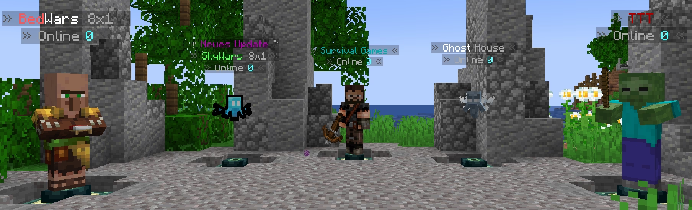
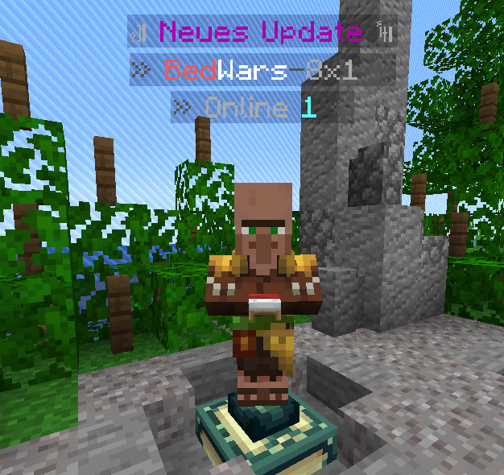
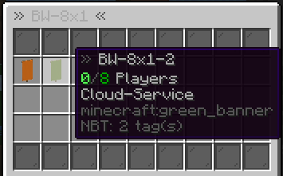

<p align="center">
  
</p>

# SimpleCloud NPC Module

With an NPC, your players can now connect to another server not only through a classic sign. They can decorate their NPC with items and add a new title line to mark updates. You can choose between a mob like a villager or a fake player with a skin of your choice. Customize your NPC to your mode with the numerous features.

## Features

- Many NPC title lines
- Loads of placeholders for titles, items and inventories
- Full configurability of all messages
- Adding mobs and fake players to your network
- Introduction of many configurable options for your NPCs

## Quick start

You can create an npc in Minecraft using the following command:

```
/cloudnpc create mob <mob-type> <npc-id> <cloud-group> <displayname>
/cloudnpc create player <npc-id> <cloud-group> <displayname>
```
For example:

```
/cloudnpc create mob VILLAGER bw-8x1 BW-8x1 &cBed&fWars&8-&78x1
/cloudnpc create player bw-8x1 BW-8x1 &cBed&fWars&8-&78x1
```

## Placeholders

 <details>
  <summary>NPC Title:</summary>

- %PLAYERS_ONLINE%
- %SERVICES_ONLINE%
- %DISPLAYNAME%
- %GROUP%
- %TEAMPLATE%

</details>

 <details>
  <summary>Inventory Title:</summary>

- %TARGET_GROUP%
- %TEMPLATE_NAME%
- %MAX_PLAYERS%

</details>

 <details>
  <summary>Inventory Item Name:</summary>

- %SERVICE_NAME%
- %TEMPLATE_NAME%
- %WRAPPER_NAME%
- %DISPLAYNAME%
- %ONLINE_PLAYERS%
- %HOST%
- %PORT%
- %STATE%
- %NUMBER%
- %MAX_PLAYERS%
- %MOTD%

</details>

 <details>
  <summary>Inventory Item Lore:</summary>

- %SERVICE_NAME%
- %TEMPLATE_NAME%
- %WRAPPER_NAME%
- %DISPLAYNAME%
- %ONLINE_PLAYERS%
- %HOST%
- %PORT%
- %STATE%
- %NUMBER%
- %MAX_PLAYERS%
- %MOTD%

</details>

## Example configs

 <details>
  <summary>Example npc config:</summary>

<p align="center">
  
</p>

```Json
{
  "npcs": [
    {
      "displayName": "&cBed&fWars&8-&78x1",
      "id": "bw-8x1",
      "isMob": true,
      "targetGroup": "BW-8x1",
      "locationData": {
        "locationGroup": "Lobby",
        "world": "world",
        "x": 133.5,
        "y": 117.0,
        "z": 159.5,
        "yaw": -148.97066,
        "pitch": 0.0
      },
      "npcAction": {
        "leftClick": "QUICK_JOIN",
        "rightClick": "OPEN_INVENTORY"
      },
      "npcItem": {
        "rightHand": "RED_BED",
        "leftHand": "null"
      },
      "npcSettings": {
        "glowing": false,
        "onFire": false,
        "mobNPCSettings": {
          "mobType": "VILLAGER"
        },
        "playerNPCData": {
          "skinData": {
            "value": "",
            "signature": ""
          },
          "flyingWithElytra": false,
          "lookAtPlayer": true,
          "hitWhenPlayerHits": false,
          "sneakWhenPlayerSneaks": false
        }
      },
      "lines": [
        "§8» §7Online §b%PLAYERS_ONLINE% §8«",
        "§8» §7%DISPLAYNAME% §8«",
        "&7&k!!! &5Neues Update &7&k!!!"
      ]
    }
  ]
}
```

</details>

<details>
  <summary>Example inventory config:</summary>

<p align="center">
  
</p>

```Json
{
  "inventory": {
    "0": "BLACK_STAINED_GLASS_PANE",
    "1": "BLACK_STAINED_GLASS_PANE",
    "2": "BLACK_STAINED_GLASS_PANE",
    "3": "BLACK_STAINED_GLASS_PANE",
    "4": "BLACK_STAINED_GLASS_PANE",
    "5": "BLACK_STAINED_GLASS_PANE",
    "6": "BLACK_STAINED_GLASS_PANE",
    "7": "BLACK_STAINED_GLASS_PANE",
    "8": "BLACK_STAINED_GLASS_PANE",
    "36": "BLACK_STAINED_GLASS_PANE",
    "37": "BLACK_STAINED_GLASS_PANE",
    "38": "BLACK_STAINED_GLASS_PANE",
    "39": "BLACK_STAINED_GLASS_PANE",
    "40": "BLACK_STAINED_GLASS_PANE",
    "41": "BLACK_STAINED_GLASS_PANE",
    "42": "BLACK_STAINED_GLASS_PANE",
    "43": "BLACK_STAINED_GLASS_PANE",
    "44": "BLACK_STAINED_GLASS_PANE"
  },
  "rows": 5,
  "inventoryName": "§8» §7%TARGET_GROUP% §8«",
  "onlineService": "GREEN_BANNER",
  "fullService": "ORANGE_BANNER",
  "itemName": "§8» §7%SERVICE_NAME%",
  "lore": [
    "§a%ONLINE_PLAYERS%§8/§2%MAX_PLAYERS% §7Players",
    "§7%MOTD%"
  ]
}
```
</details>
